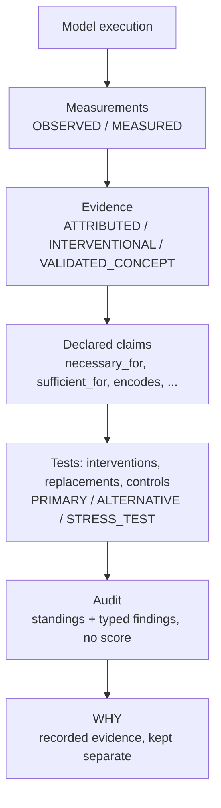

# BeyondNN

**Auditable interpretability evidence for PyTorch.**

[](https://github.com/NikolasRoufas/beyondnn/actions/workflows/ci.yml)

[](LICENSE)

BeyondNN turns claims about neural-network computation into structured, provenance-aware, testable objects, and audits them against the evidence you actually recorded.

> **Status:** BeyondNN 0.1.0 is the first public pre-1.0 release (research software; the public API is frozen, see [`docs/API_FREEZE.md`](docs/API_FREEZE.md)). PyPI publication is pending. Install from GitHub as shown below.

## Why BeyondNN exists

Interpretability methods answer different questions, and the answers are easy to conflate:

- **An attribution** says a method assigned relevance to a unit. It is not a causal effect.
- **A decodable feature** says a probe can read something from an activation. It does not mean the model *uses* it.
- **A salient component** is not necessarily *necessary*: a redundant path can make its removal harmless.
- **An intervention result** depends on the replacement used. Zeroing, mean-ablation and resampling can give different answers.
- **A readable label** is not a validated concept.

BeyondNN keeps these distinctions explicit:
- every piece of evidence carries its epistemic status and full provenance;
- every claim is declared before it is tested;
- an audit states what the recorded evidence establishes about each claim, under which assumptions, and what it does not establish.

It never produces a single "explanation quality" score.



| Not the same thing | |
|---|---|
| measurement | ≠ claim |
| attribution | ≠ causal effect |
| decodability | ≠ causal use |
| generated label | ≠ validated concept |

## Installation

BeyondNN needs Python ≥ 3.10 and PyTorch ≥ 2.3. It is tested on Python 3.10, 3.12 and 3.14 (CPU).

**From source, with [uv](https://docs.astral.sh/uv/):**

```bash
git clone https://github.com/NikolasRoufas/beyondnn.git
cd beyondnn
uv sync                      # creates .venv with the locked dev environment
uv run python -c "import beyondnn; print(beyondnn.__version__)"
```

**After the PyPI release** (pending):

```bash
pip install beyondnn
```

**With pip, from GitHub (works now):**

```bash
pip install "beyondnn @ git+https://github.com/NikolasRoufas/beyondnn.git@v0.1.0"
pip install "beyondnn[captum] @ git+https://github.com/NikolasRoufas/beyondnn.git@v0.1.0"   # optional Captum adapter
```

`import beyondnn` does not import torch. The tracing API loads torch lazily.

## Five-minute quickstart

A model with two redundant paths: `y = p(x) + q(x)`, where `p` and `q` both compute `x0`. Attribution credits `p`, but removing `p` does not remove `y`.

```python
# runnable example (executed by tests/test_readme.py)
import torch
from torch import nn

import beyondnn as bnn

A, iv, AU = bnn.attribution, bnn.interventions, bnn.audits


class Redundant(nn.Module):
    def __init__(self) -> None:
        super().__init__()
        self.p = nn.Linear(2, 1, bias=False)
        self.q = nn.Linear(2, 1, bias=False)
        with torch.no_grad():
            self.p.weight.copy_(torch.tensor([[1.0, 0.0]]))
            self.q.weight.copy_(torch.tensor([[1.0, 0.0]]))

    def forward(self, x: torch.Tensor) -> torch.Tensor:
        return self.p(x) + self.q(x)


model, x = Redundant().eval(), torch.tensor([[3.0, 5.0]])
target = iv.metrics.select([0, 0])  # one explicit scalar target; outputs are never summed

# 1. Evidence: an attribution (ATTRIBUTED) and a controlled intervention (INTERVENTIONAL),
#    each with the claim it tests declared before it runs
ig = A.integrated_gradients(baseline=A.zero_baseline(), n_steps=16)
credit = A.make_claim(A.layer("p"), target, x, statement="p receives attribution for y")
attribution = bnn.attribute(model, x, target=target, at=A.layer("p"), method=ig, claims=[
    (credit, A.threshold_spec(ig, at=A.layer("p"), min_abs_attribution=2.0))])
claim = iv.make_claim(iv.zero("p"), target, bnn.Relation.NECESSARY_FOR, x,
                      statement="p is necessary for y")
effect = bnn.intervene(model, x, intervention=iv.zero("p"), metric=target, claims=[
    (claim, iv.threshold_spec(operation=bnn.schema.InterventionOperation.ZERO, min_effect=6.0))])
print(attribution.record.status, effect.effect.status, effect.value)

# 2. A plan, declared before the audit
plan = AU.plan(
    name="quickstart", checkpoint=AU.checkpoint_of(model), declared_model=None,
    samples=[AU.sample_id(x)], datasets=[], concepts=[], naive_auroc=None,
    claims=[AU.claim("p_necessary", statement="p is necessary for y", relation="necessary_for",
                     target=target, scope="instance", requirement="intervention",
                     subject=bnn.schema.Subject(site=bnn.schema.Site(module="p")))],
    requirements=[AU.requirement("intervention", policy=iv.INTERVENTION_POLICY, controls=False)],
    counterexamples=AU.counterexample_rule(max_counterexample_fraction=None,
                                           max_false_positive_rate=None,
                                           max_false_negative_rate=None))

# 3. Audit: attribution alone cannot support a causal claim; the intervention contradicts it
for evidence in ([attribution], [attribution, effect]):
    audited = bnn.audit(evidence, plan=plan).claim("p_necessary")
    print(dict(audited.distribution), sorted(f.code for f in audited.findings))

# 4. WHY: the recorded evidence, kept separate, with the audit attached
report = bnn.audit([attribution, effect], plan=plan)
why = bnn.compose(bnn.trace(model, x, sites=["p", "q"]), attributions=[attribution],
                  interventions=[effect], audit=report)
print(why.render())
```

Output (abridged):

```text
EvidenceStatus.ATTRIBUTED EvidenceStatus.INTERVENTIONAL -3.0
{'unsupported': 1} ['attribution_is_not_intervention']
{'contradicted': 1} ['attribution_intervention_disagree', 'counterexamples_present']
```

Attribution-only evidence leaves the causal claim **UNSUPPORTED**, not supported. The intervention **CONTRADICTS** "p is necessary": zeroing `p` changes `y` by −3.0, but `y` does not go away, because `q` computes the same value.

## A realistic end-to-end example

A token-level claim with **declared unit eligibility**, **explicit named replacements** in declared **roles**, and **matched random controls**. Position 0 plays a model-control token (like `[CLS]`) that the model relies on heavily.

```python
# runnable example (executed by tests/test_readme.py)
import torch
from torch import nn

import beyondnn as bnn

A, F, iv, AU = bnn.attribution, bnn.faithfulness, bnn.interventions, bnn.audits


class TokenModel(nn.Module):
    """Logit = 4*e0 + 2*e3 + 1*e5 over 8 positions of a 1-d 'embedding'; position 0 is special."""

    def __init__(self) -> None:
        super().__init__()
        self.embed = nn.Identity()
        self.register_buffer("w", torch.tensor([4.0, 0, 0, 2.0, 0, 1.0, 0, 0]))

    def forward(self, x: torch.Tensor) -> torch.Tensor:
        return torch.stack([torch.zeros(len(x)), (self.embed(x) * self.w).sum(-1)], dim=1)


model = TokenModel().eval()
samples = [torch.ones(1, 8) + 0.1 * i for i in range(3)]
content = tuple(range(1, 8))  # declared by the caller: every position except the special one
mean = F.replacement(torch.full((1, 8), 0.05), name="train_mean")    # a named replacement
extreme = F.replacement(torch.full((1, 8), 10.0), name="extreme")    # deliberately extreme

results, attributions, targets = [], [], {}
for i, x in enumerate(samples):
    target = iv.metrics.margin([0, 1])  # predicted class minus the best other class
    attr = bnn.attribute(model, x, target=target, at=A.layer("embed"),
                         method=A.integrated_gradients(baseline=A.zero_baseline(), n_steps=16))
    attributions.append(attr)
    targets[AU.sample_id(x)] = target
    selection = F.top_k(attr, k=2, eligible=content, eligibility="content_tokens")
    for replacement in (mean, extreme):
        test = F.comprehensiveness(target=target, min_drop=0.3 * float(target(model(x))),
                                   replacement=replacement,
                                   controls=F.controls(20, seed=i), min_fraction_below=0.9,
                                   statement="the top-2 content tokens are necessary")
        results.append(F.run(model, x, test=test, selection=selection, attributions=[attr]))

plan = AU.plan(
    name="content_tokens", checkpoint=AU.checkpoint_of(model), declared_model=None,
    samples=list(targets), datasets=[], concepts=[], naive_auroc=None,
    claims=[AU.claim(
        "top2_content_necessary", statement="the IG top-2 content tokens are necessary",
        relation="necessary_for", target=None, sample_targets=targets, scope="instance",
        requirement="necessity",
        selection=AU.selection("embed", method="integrated_gradients", k=2,
                               eligibility="content_tokens"),
        roles=[AU.role("replacement", "tensor/train_mean:*", "primary"),
               AU.role("replacement", "tensor/extreme:*", "stress_test")])],
    requirements=[AU.requirement("necessity", policy=F.COMPREHENSIVENESS_POLICY, controls=True)],
    counterexamples=AU.counterexample_rule(max_counterexample_fraction=None,
                                           max_false_positive_rate=None,
                                           max_false_negative_rate=None))

report = bnn.audit([*results, *attributions], plan=plan)
claim = report.claim("top2_content_necessary")  # look claims up by name
print(dict(claim.distribution))
print(sorted({f.code for g in claim.groups for f in g.findings}))
print(claim.groups[0].profile.describe())
print(results[0].selection.eligibility, results[0].selection.selected)
```

Output (abridged):

```text
{'supported': 3}
['stress_test_reverses']
1 of 2 tested configurations SUPPORT (primary 1 of 1, stress_test 0 of 1)
content_tokens (3, 5)
```

- **Selection:** the special position 0 is never selected, because the *claim* is about content tokens.
- **Replacements and roles:** the PRIMARY (train-mean) replacement decides the standing. The extreme STRESS_TEST replacement reverses the result; that is visible as `stress_test_reverses` and in the profile, but it does not rewrite the PRIMARY conclusion.
- **Controls:** random 2-token sets are drawn from content tokens only.

## Core concepts

### Evidence statuses

Every record states how it was obtained. The status says what it *can* justify.

| status | meaning | can justify | cannot justify |
|---|---|---|---|
| `OBSERVED` | a value that crossed the model boundary unchanged (inputs, outputs) | what went in and came out | anything internal |
| `MEASURED` | internal state read directly (e.g. a module output) | what the state was | why the output happened |
| `ATTRIBUTED` | a method-relative relevance score (gradient, integrated gradients, …) | "method M assigned relevance r to unit u for target T" | necessity, sufficiency, causal use |
| `INTERVENTIONAL` | the directly measured effect of a declared intervention on the declared inputs | "under this intervention and replacement, on these inputs, the target changed by Δ" | population claims; other replacements |
| `ESTIMATED_CAUSAL` | an approximation of an interventional or population quantity | reserved in the schema; no current protocol produces it | — |
| `VALIDATED_CONCEPT` | an activation of a concept that passed a declared validation protocol | "the concept met the declared encoding and use criteria, in this scope" | universal semantic truth |
| `GENERATED` | produced by a model, LLM or template | nothing: it is never scientific evidence | validation of anything |

### Claims and scope

A claim is a first-class, declared object:
- a **relation**: `necessary_for`, `sufficient_for`, `attributed_to`, `encodes`, `decreases`, …;
- a **subject**: a site, units or a feature, or the units a method selects;
- a **target** metric;
- an **estimand scope**: `instance` (one sample), `finite_sample` (an exact set) or `population`.

Evidence is matched to a claim by structure: the same relation, target, subject or selection, eligibility, checkpoint and samples.

Examples:
- "these units are necessary for this prediction" is a `necessary_for` claim on a selection, instance scope.
- "this direction encodes concept X" is an `encodes` claim with a dataset scope.
- "this concept is causally used" is a use claim (`decreases` / `increases`) with a declared intervention.

### Audit standings

An audit is deterministic and model-free. It re-derives every recorded result and classifies each declared claim:

| standing | meaning |
|---|---|
| `SUPPORTED` | the required evidence supports the claim under the plan, with no disagreement and no overclaim finding |
| `CONTRADICTED` | the required evidence contradicts the claim |
| `UNSUPPORTED` | evidence exists, but it **cannot establish the claim as stated** (e.g. only attribution for a causal claim; decodability without use; a generated label; a narrower scope) |
| `INCONCLUSIVE` | the evidence does not decide (e.g. a no-op intervention, or a control criterion that could not be met) |
| `ASSUMPTION_SENSITIVE` | decisive results disagree, and every disagreement is explained by a recorded assumption |
| `MIXED` | decisive results disagree without a recorded explanation |
| `NOT_EVALUATED` | no in-scope evidence |

**UNSUPPORTED is not a weak CONTRADICTED.**
- CONTRADICTED means the right kind of evidence was recorded and it went against the claim.
- UNSUPPORTED means the recorded evidence is of the wrong kind or scope to decide it.

Standings are not confidence levels. There is **no global score**: every standing comes with typed findings (for example `attribution_is_not_intervention`, `stress_test_reverses`, `control_criterion_unattainable`).

### Configuration roles

Many conclusions depend on choices: the replacement, k, the null, the threshold. A plan declares each configuration's role *before* the audit:

- **PRIMARY:** the pre-registered analysis. **Only PRIMARY configurations decide the standing.**
- **ALTERNATIVE:** another reasonable choice. A reversal is reported as `alternative_reverses`, a qualifying finding.
- **STRESS_TEST:** a deliberately extreme choice. A reversal is reported as `stress_test_reverses`, an informational finding.

Alternatives and stress tests never silently rewrite the PRIMARY conclusion. They stay visible in each group's `SensitivityProfile`: raw counts, not a robustness score.

```python
roles = [AU.role("replacement", "tensor/train_mean:*", "primary"),
         AU.role("replacement", "tensor/pad_embedding:*", "alternative"),
         AU.role("replacement", "zero", "stress_test")]
```

### Unit eligibility

"The top-k tokens" and "the top-k *content* tokens" are different claims. **Eligibility is part of the claim.**

```python
content = [i for i, t in enumerate(input_ids[0].tolist()) if t not in tokenizer.all_special_ids]
selection = F.top_k(attribution, k=2, eligible=content, eligibility="content_tokens")
AU.selection(site, method="integrated_gradients", k=None, eligibility="content_tokens")
```

- **Scope of an eligibility:** rankings, random selections and matched controls use only the eligible units. Evidence about one eligibility is never used for a claim about another (`eligibility_mismatch`).
- **Nothing is filtered automatically.** An all-units claim (`eligibility=None`) includes special tokens, because a model may genuinely depend on them.

### Replacements

Every intervention states what replaces the removed units. **There is no implicit zero.**
- `F.zero()`: explicit zeros.
- `F.replacement(tensor, name=...)`: any tensor of the site's shape, e.g. a training mean, another sample's activation (a resample), or a `[MASK]` / `[PAD]` embedding.

The name and a content digest are recorded and appear in the audit's assumption axes (`tensor/train_mean:…`).

BeyondNN does not assume a universal safe replacement. Different replacements can reach different conclusions, and the audit reports it.

### Controls

- **What they are:** faithfulness tests can require matched random controls: random unit sets of the same size, or the same perturbation magnitude, at the same site.
- **Unattainable criteria:** if the declared control criterion could not be met by any model (for example, too few distinct alternative units), a failing result is INCONCLUSIVE, never a contradiction (`control_criterion_unattainable`).
- **Competitive-only failure:** if the effect is present but random sets do as well, the finding says exactly that (`effect_without_competitive_advantage`).

### Provenance

Every record is bound to:
- the model **checkpoint** (a full state digest) and optional declared model configuration;
- the **sample** (an exact input identity) and the concept **dataset**;
- the **target** metric, the **protocol** and its version, the **replacement** identity, the declared **eligibility** and the control configuration with its **seed**;
- the software environment: BeyondNN, torch and Python versions.

Records are content-addressed and versioned, with tested migrations for older versions. Reports record the plan's identity and the BeyondNN version and audit rules that produced them.

**Evidence never silently counts** if it comes from another checkpoint (`other_checkpoint`), another sample (`sample_out_of_scope`) or another dataset scope. It is excluded, and the exclusion is reported.

### Save, reload, verify

Saved evidence is independently re-auditable:

```python
# runnable example (executed by tests/test_readme.py)
import tempfile
from pathlib import Path

import torch
from torch import nn

import beyondnn as bnn

A, F, iv, AU = bnn.attribution, bnn.faithfulness, bnn.interventions, bnn.audits
model = nn.Sequential(nn.Linear(4, 2)).eval()
with torch.no_grad():
    model[0].weight.copy_(torch.tensor([[0.0, 0, 0, 0], [3.0, 1.0, 0, 0]]))
    model[0].bias.zero_()
x = torch.tensor([[1.0, 1.0, 1.0, 1.0]])
target = iv.metrics.margin([0, 1])
attr = bnn.attribute(model, x, target=target, method=A.gradient())
test = F.comprehensiveness(target=target, min_drop=1.0, replacement=F.zero(),
                           statement="the top-1 input is necessary")
result = F.run(model, x, test=test, selection=F.top_k(attr, k=1), attributions=[attr])
plan = AU.plan(
    name="persisted", checkpoint=AU.checkpoint_of(model), declared_model=None,
    samples=[AU.sample_id(x)], datasets=[], concepts=[], naive_auroc=None,
    claims=[AU.claim("top1_necessary", statement="the top-1 input is necessary",
                     relation="necessary_for", target=target, scope="instance",
                     requirement="necessity",
                     selection=AU.selection("input", method="gradient", k=1))],
    requirements=[AU.requirement("necessity", policy=F.COMPREHENSIVENESS_POLICY, controls=False)],
    counterexamples=AU.counterexample_rule(max_counterexample_fraction=None,
                                           max_false_positive_rate=None,
                                           max_false_negative_rate=None))
report = bnn.audit([result, attr], plan=plan)

out = Path(tempfile.mkdtemp())
AU.save_evidence([result, attr], out / "evidence")      # exactly the traces the audit ingested
(out / "plan.json").write_text(bnn.schema.to_json(plan))
report.save(out / "report.json")

# ... later, in a fresh Python process:
plan2 = bnn.schema.from_json((out / "plan.json").read_text())
paths = AU.load_evidence(out / "evidence")               # every record is re-validated on load
again = bnn.audit(paths, plan=plan2, model=model)         # refuses any other checkpoint
AU.verify_report(AU.load_report(out / "report.json"), paths, plan2)  # re-derives; never corrects
print(dict(again.claim("top1_necessary").distribution))
```

The permanent test `tests/test_golden_workflow.py` runs the full save → fresh process → load → verify → audit → WHY loop.

### Concepts: decodable versus used

A concept hypothesis moves through `UNLABELED_FEATURE` → `PROPOSED_CONCEPT` → `VALIDATED_CONCEPT`.
- **Validation requires both:** an encoding test (decodable above random-direction and label-permutation controls) *and* a declared use test (an intervention changes the target beyond controls).
- **Decodable but unused** stays PROPOSED. **Generated labels** stay GENERATED and are never upgraded automatically.

```python
# runnable example (executed by tests/test_readme.py)
import torch
from torch import nn

import beyondnn as bnn

C, iv = bnn.concepts, bnn.interventions


class Toy(nn.Module):
    """hidden = x (6 units); output = 3*h0: h0 is used, h1 is decodable but never read."""

    def __init__(self) -> None:
        super().__init__()
        self.hidden = nn.Identity()

    def forward(self, x: torch.Tensor) -> torch.Tensor:
        return 3.0 * self.hidden(x)[:, :1]


model = Toy().eval()
x = torch.randn(200, 6, generator=torch.Generator().manual_seed(0))
splits = ["train"] * 100 + ["val"] * 40 + ["test"] * 60
train_sd = float(model(x[:100]).std())  # declare min_change in the target's own scale
for unit in (0, 1):
    data = C.dataset([x[i : i + 1] for i in range(200)], (x[:, unit] > 0).long().tolist(), splits,
                     name=f"x{unit} positive", label_source=f"x{unit} > 0")
    concept = C.propose(C.neuron("hidden", unit), label=f"x{unit} is positive",
                        definition=f"x{unit} > 0")
    encoding = C.encoding_test(model, concept, data,
                               criteria=C.encoding_criteria(min_fraction_below=0.8),
                               controls=[C.random_neurons(5, seed=1), C.label_permutation(50, seed=2)])
    use = C.use_test(model, concept, data, target=iv.metrics.select([0, 0]), relation="decreases",
                     intervention=C.remove(C.zero()), controls=[C.random_neurons(5, seed=3)],
                     criteria=C.use_criteria(min_change=0.2 * train_sd,
                                             min_fraction_beyond_controls=0.8))
    validation = C.validate(concept, encoding=encoding, use=[use])
    print(unit, encoding.outcome.value, use.outcome.value, validation.semantic_status.value)
```

```text
0 supports supports validated_concept
1 supports contradicts proposed_concept
```

Unit 1 is decodable but not used, so it is never "validated".

`VALIDATED_CONCEPT` means the declared criteria were met within the recorded scope (checkpoint, site, dataset split, intervention, target). It does not mean the model "understands" the concept.

### WHY

`bnn.compose(trace, attributions=..., interventions=..., faithfulness=..., concepts=..., audit=...)` assembles recorded evidence into one structured view:
- **It runs nothing:** it only arranges records that already exist.
- **It never merges evidence kinds** into a narrative or a score.
- **It refuses** evidence about another model, input or target.
- **It lists what was not evaluated.**

`response.render()` gives a deterministic text view with sections for measurements, attributions, interventions, faithfulness, concepts and the audit. The first example above prints one.

## Examples

Runnable scripts in [`examples/`](examples/). Each one runs in CI.

| script | shows |
|---|---|
| [`01_quickstart.py`](examples/01_quickstart.py) | trace → evidence → claim → audit → WHY |
| [`02_attribution.py`](examples/02_attribution.py) | attribution as ATTRIBUTED evidence; baselines; completeness |
| [`03_intervention.py`](examples/03_intervention.py) | controlled interventions on a redundant path |
| [`04_faithfulness.py`](examples/04_faithfulness.py) | comprehensiveness with explicit replacements, controls and eligibility |
| [`05_concepts.py`](examples/05_concepts.py) | concept proposal, encoding and use tests, validation |
| [`06_audit.py`](examples/06_audit.py) | audit plans, roles, standings and findings |
| [`07_save_reload.py`](examples/07_save_reload.py) | save evidence, reload, re-audit, verify |

## Where BeyondNN fits

BeyondNN is meant to be used *alongside* existing tools:

| tool | role |
|---|---|
| PyTorch | execution and autograd substrate |
| Captum | attribution methods (BeyondNN has an optional Captum adapter) |
| NNsight, TransformerLens, pyvene | model tracing, patching and mechanistic analysis |
| Quantus | explanation-quality metrics |
| **BeyondNN** | provenance-aware records of evidence, declared claims, and an audit of what the evidence establishes |

## Validation (scoped)

The framework was evaluated with pre-registered, held-out experiments. The headline observations, with their scope (details and exact wording in [`docs/research/PAPER_EVIDENCE_LEDGER.md`](docs/research/PAPER_EVIDENCE_LEDGER.md)):

- **Independent ground truth (compiled programs only).** On 8 held-out compiled Tracr programs, whose ground truth comes from the program text and weights (not from an intervention):
  - the audit supported 0 of 400 decoy-component instances, including 0 of 160 decoys that are exact copies of the used variable;
  - it supported every used component on most samples (591 of 760 instances).
  - This does not establish mechanism identification in trained models.
- **Attribution-only causal claims are refused.** They were UNSUPPORTED everywhere they were tested. IG-selected wrong components were contradicted when intervention evidence existed.
- **Configuration sensitivity is real.** On six held-out sites (MLP, CNN, BERT-tiny, BERT-base), 47 of the 52 samples where the top-k attribution units were supported as necessary were reversed by a pre-declared reasonable alternative.
- **Save / reload / re-audit** gives identical conclusions from saved evidence, from a clean install.

## Limitations

- **Independent mechanism ground truth** is currently available only for small compiled (Tracr) models. On trained models, the evidence is configuration sensitivity without ground truth.
- **Intervention conclusions depend on the replacement.** Zero ablation supported every decoy in the compiled benchmark. No replacement is universally safe.
- **A single counterfactual per sample** can miss a genuinely necessary component (22% of known-true instances in the compiled benchmark).
- **A standing is scoped** to its declared checkpoint, samples, target, eligibility and configurations.
- **Concept validation** is validation under declared criteria in a recorded scope, not universal semantic truth. Its use threshold is declared in the target's scale.
- **Coverage:** CPU-verified; PyTorch models with module-level sites (functional operations are not hookable). Larger models make evidence collection expensive in time and disk.
- **There is no universal explanation-quality score, by design.**

## Documentation

Start at [`docs/README.md`](docs/README.md): guides for tracing, attribution, interventions, faithfulness protocols, concepts, audits and provenance, plus [reproducibility](docs/REPRODUCIBILITY.md) and the research record.

## Contributing, security, citation

- **Contributing:** [`CONTRIBUTING.md`](CONTRIBUTING.md) covers setup, tests, the API freeze and the scientific invariants that ordinary changes must not break ([`docs/PRE_PHASE8_INVARIANTS.md`](docs/PRE_PHASE8_INVARIANTS.md)).
- **Security:** [`SECURITY.md`](SECURITY.md). Report privately via GitHub security advisories.
- **Code of conduct:** [`CODE_OF_CONDUCT.md`](CODE_OF_CONDUCT.md).
- **Citation:** [`CITATION.cff`](CITATION.cff) (the software; no paper yet).

## License

[Apache-2.0](LICENSE)
